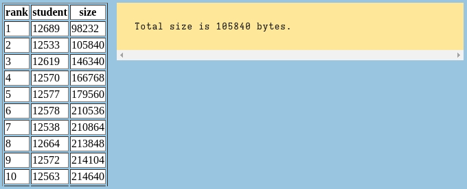

# wlp4c

A compiler for the WLP4 educational language.

# Optimizations

Came 2nd in the course at the optimization challenge, which seeks to minimize the size of the binary produced for a specific input.

Optimizations include:
* common subexpression elimination
* conditional branching elimination
* minimization of stack operations
* use of registers for intermediate operations
* extremely rudimentary constant folding

# How to Use

Input to `wlp4c` is in the form of [WLP4I representation.](https://student.cs.uwaterloo.ca/~cs241/wlp4/wlp4i.html)

For more information on how to use the intermediate formats, refer to the `tests/runtests` script.
